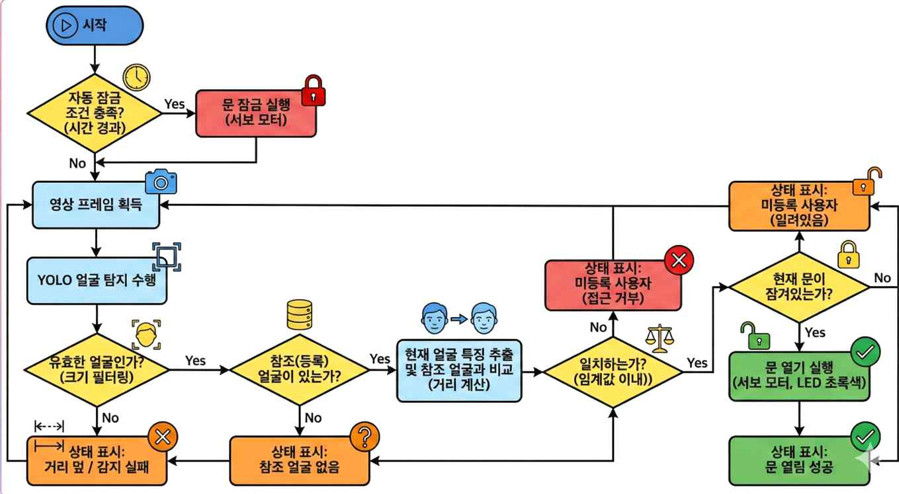
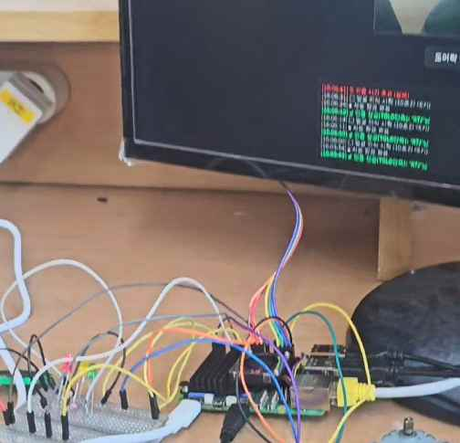
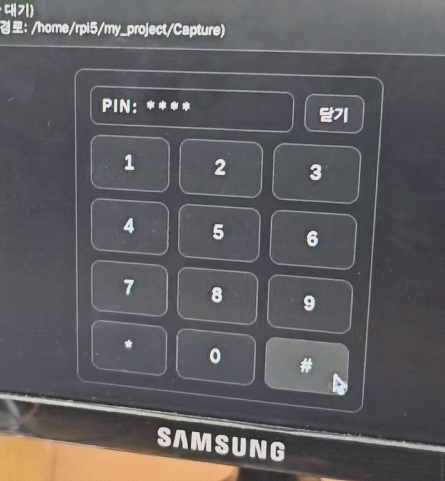

# AI 얼굴인식 스마트 도어락

임베디드시스템 기말 프로젝트로 제작한 **YOLO 기반 얼굴인식 도어락 시스템**입니다. 카메라 영상에서 사용자의 얼굴을 탐지하고, 등록된 사용자 여부를 확인한 뒤 서보 모터로 도어락을 제어합니다. Flask 웹 대시보드를 통해 실시간 영상, 인증 상태, 로그, 원격 개방, 키패드 비상 개방까지 확인할 수 있도록 구현했습니다.

> 한 줄 요약: **AI 얼굴 인식 + 임베디드 하드웨어 제어 + 웹 모니터링을 하나의 동작 가능한 도어락 프로토타입으로 통합한 프로젝트**

## Demo

- 시연 영상: https://www.youtube.com/watch?v=cE46y3rbjK8
- 최종 보고서: [임베디드 보고서_001_7조_최종보고서.pdf](<./임베디드 보고서_001_7조_최종보고서.pdf>)



## 핵심 기능

| 기능 | 설명 |
| --- | --- |
| 실시간 얼굴 탐지 | OpenCV 카메라 프레임을 YOLO 모델에 입력해 얼굴 영역을 탐지합니다. |
| 등록 사용자 인증 | 탐지된 얼굴의 클래스명과 선택적 얼굴 임베딩 비교로 등록 사용자 여부를 판단합니다. |
| 자동 도어락 제어 | 인증 성공 시 서보 모터를 동작시켜 문을 열고, 설정 시간이 지나면 자동으로 잠급니다. |
| 웹 대시보드 | Flask 기반 웹 화면에서 실시간 영상 스트림, 상태 배지, 시스템 로그를 확인합니다. |
| 학습 데이터 캡처 | 웹 버튼으로 현재 카메라 프레임을 저장해 추가 학습 데이터 수집에 활용합니다. |
| 비상 키패드 | 얼굴 인증이 어려운 상황을 대비해 웹 키패드 PIN으로 강제 개방할 수 있습니다. |

## 시스템 구성



```text
Camera
  -> OpenCV frame capture
  -> YOLO face detection
  -> face size filtering
  -> registered user check
  -> optional face_recognition embedding match
  -> servo unlock / lock
  -> Flask dashboard status update
```

### 인증 흐름

1. 사용자가 웹 대시보드에서 인증을 요청합니다.
2. 시스템은 10초 동안 카메라 프레임에서 얼굴을 탐지합니다.
3. 얼굴 박스가 너무 작으면 오탐 방지를 위해 제외합니다.
4. 탐지된 이름이 등록 사용자 목록에 있는지 확인합니다.
5. 참조 얼굴 데이터가 있으면 얼굴 임베딩 거리까지 비교합니다.
6. 인증 성공 시 문을 열고, 3초 후 자동으로 다시 잠급니다.
7. 인증 실패 또는 시간 초과 시 실패 로그와 알림을 남깁니다.



## 기술 스택

| 영역 | 사용 기술 |
| --- | --- |
| Language | Python, HTML, CSS, JavaScript |
| AI / Vision | Ultralytics YOLO, OpenCV, face_recognition optional |
| Web | Flask, MJPEG streaming, Fetch API |
| Embedded | Raspberry Pi 환경, 서보 모터, LED, 부저 |
| Concurrency | Python threading, Event, Condition |
| State / Log | 전역 상태 모듈, deque 기반 최근 로그 관리 |

## 구현 포인트

### 1. 실시간 영상 스트리밍과 AI 추론 분리

`main.py`는 Flask 라우팅과 MJPEG 스트리밍을 담당하고, `core_system.py`는 카메라 입력, 얼굴 탐지, 인증 판단, 도어락 제어를 담당합니다. 웹 서버와 카메라 처리 루프를 별도 스레드로 분리해 영상 표시와 인증 처리가 동시에 동작하도록 구성했습니다.

### 2. 인증 정확도 보완

YOLO 탐지 결과만 바로 신뢰하지 않고, 얼굴 박스 면적 비율을 기준으로 너무 작은 얼굴을 제외합니다. 또한 `face_recognition` 라이브러리가 설치되어 있고 참조 얼굴 데이터가 준비된 경우, 얼굴 임베딩 거리까지 비교해 인증 신뢰도를 높이도록 설계했습니다.

### 3. 임베디드 장치 제어와 사용자 피드백

인증 성공, 실패, 자동 잠금 같은 상태 변화는 로그로 남기고, 서보 모터/부저/LED 제어 함수와 연결했습니다. 웹 화면에서도 `LOCKED`, `OPEN`, `DETECTING` 상태를 실시간으로 확인할 수 있습니다.

### 4. 시연과 운영을 고려한 보조 기능

학습용 이미지 캡처, 원격 강제 개방, 키패드 입력, 최근 로그 확인 기능을 넣어 단순 모델 테스트가 아니라 실제 도어락 시나리오에 가까운 프로토타입으로 구성했습니다.

## 프로젝트 구조

```text
doorlock/
├─ Embedded Project/
│  ├─ main.py              # Flask 앱, 영상 스트리밍, 웹 API
│  ├─ core_system.py       # 카메라 루프, 인증 처리, 자동 잠금
│  ├─ ai_engine.py         # YOLO 모델 로딩 및 추론 래퍼
│  ├─ auth_service.py      # 얼굴 임베딩/클래스 기반 인증 비교
│  ├─ config.py            # 모델 경로, 인증 기준, FPS 등 설정
│  ├─ state.py             # 전역 상태, 이벤트, 로그 버퍼
│  ├─ logger.py            # 시스템 로그 관리
│  ├─ tools.py             # 공통 유틸리티
│  └─ templates/
│     └─ index.html        # 웹 대시보드 UI
├─ assets/                 # README용 보고서 이미지
├─ Demo.mp4                # 프로젝트 시연 영상
└─ 임베디드 보고서_001_7조_최종보고서.pdf
```

## 실행 방법

> 현재 저장소 기준으로 `servo_lock.py`와 `yolov8n-facebest.pt`는 별도 준비가 필요합니다. Raspberry Pi에서 실제 서보 모터/부저/LED를 제어하려면 하드웨어 핀 설정이 포함된 `servo_lock.py`가 `Embedded Project` 폴더에 있어야 합니다.

```bash
cd "Embedded Project"
python -m venv .venv
.venv\Scripts\activate
pip install flask opencv-python ultralytics
pip install face-recognition  # 선택 사항: 얼굴 임베딩 비교 사용 시
python main.py
```

실행 후 브라우저에서 아래 주소로 접속합니다.

```text
http://localhost:5000
```

Raspberry Pi에서 실행하는 경우 같은 네트워크의 PC/모바일에서 `http://<라즈베리파이 IP>:5000`으로 접속하면 됩니다.

## 주요 설정값

| 설정 | 값 | 의미 |
| --- | ---: | --- |
| `AUTHORIZED_USERS` | `HJH`, `KTJ`, `LJY`, `HKM` | 인증 허용 사용자 클래스 |
| `AUTH_TIMEOUT` | `10.0` | 인증 요청 후 제한 시간 |
| `DOOR_OPEN_SECONDS` | `3.0` | 문 개방 후 자동 잠금까지의 시간 |
| `DETECT_FPS` | `15` | AI 탐지 루프 FPS |
| `STREAM_FPS` | `12` | 웹 영상 스트리밍 FPS |
| `FACE_DISTANCE_THRESHOLD` | `0.65` | 얼굴 임베딩 비교 임계값 |

## 개선 가능성

- 웹 키패드 PIN이 프론트엔드 코드에 있어 실제 서비스에서는 서버 측 검증과 해시 저장으로 변경해야 합니다.
- 사진/영상 재생 공격을 막기 위해 눈 깜빡임, 깊이 정보, 랜덤 동작 요청 같은 라이브니스 검증을 추가할 수 있습니다.
- 모델 가중치와 하드웨어 제어 모듈을 배포 패키지에 포함하고, PC 테스트용 mock `servo_lock`을 제공하면 재현성이 좋아집니다.
- 인증 로그를 메모리뿐 아니라 파일 또는 DB에 저장하면 사후 분석과 보안 감사가 쉬워집니다.

## 면접에서 설명할 포인트

- AI 모델 추론 결과를 바로 액션으로 연결하지 않고, 크기 필터와 2차 얼굴 비교로 오탐 리스크를 줄였습니다.
- Flask 웹 서버와 카메라/인증 루프를 스레드로 분리해 실시간 UI와 하드웨어 제어가 동시에 동작하도록 구성했습니다.
- 단순 인식 모델 구현에 그치지 않고, 자동 잠금, 비상 키패드, 로그, 학습 데이터 캡처까지 실제 도어락 사용 시나리오를 고려했습니다.
- 임베디드 프로젝트에서 중요한 “센서 입력 → 판단 → 액추에이터 제어 → 사용자 피드백” 전체 흐름을 하나의 프로토타입으로 완성했습니다.
